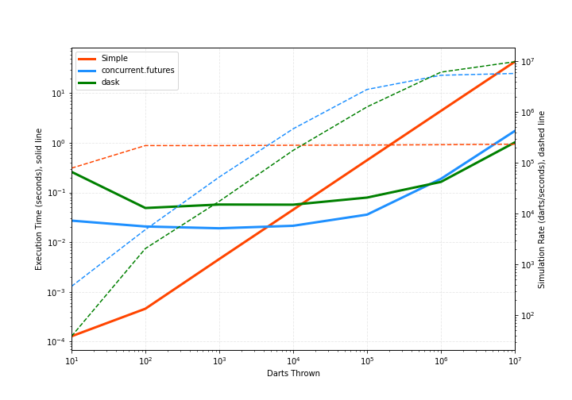

The simplest approach is sequnetial where darts are thrown one-by-one. 
Advantage: simple to implement and works fast when the number of darts is small, e.g. < O(1e4). 
With larger number of darts, the execution time scales with O(n) (shown by the flat dart rate curve).

The multi-processing (concurrent.futures) method uses multiple CPUs on my laptop. 
With an "1.4 GHz Quad-Core Intel Core i5" processor, the maximum number of processors is 8 
(if counting "Hyperthreads" that divide one processor into two virtual processors). 
The time complexity is roughly O(n/8), much better than the sequential approach.

The dask approach is similar to the previous one as it also utilizes multiple processors. 
One advantage is that we can monitor the running process by looking at the client dashboard.
